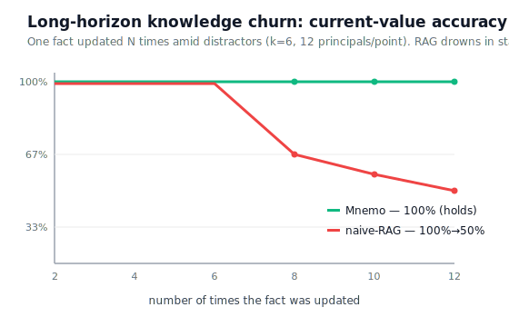

<div align="center">

# Tenet

### Agent Memory as a Self-Consistent World Model

[](paper/tenet.md)
[](LICENSE)
[](https://qwencloud-hackathon.devpost.com)
[](#)

*A memory that stays true as the world changes.* Built for the
[Global AI Hackathon with Qwen Cloud](https://qwencloud-hackathon.devpost.com) — **Track 1**.

</div>

---

LLM-agent memory is almost always **retrieval over a log of past turns**. That's the wrong
abstraction for an agent modeling a *changing* world: as a fact is updated over a long
interaction — **knowledge churn** — stale versions crowd the retrieval budget and the agent
answers with an out-of-date value. **Tenet** reframes memory as a **self-consistent belief
state** — a compact *world model of the user* — and stays correct where retrieval collapses.

<div align="center">



**As a fact is updated 2→12 times, RAG-memory falls 100%→50%. Tenet holds 100%.**

</div>

## Why it's different

| | retrieval memory (RAG) | **Tenet** |
|---|---|---|
| abstraction | document index of turns | **belief state (world model)** |
| a changed fact | two similar passages | **superseded** (bi-temporal, history kept) |
| stale evidence | retrieved forever | **retired** (belief–evidence consistency) |
| write policy | store everything | **surprise-gated** (predictive coding) |
| forgetting | none (grows forever) | salience-decay sweep |
| queryable across time | no | **time-travel** (`recall(as_of=t)`) |
| read path | — | **no LLM call** |

Read the 2-page paper: **[`paper/tenet.md`](paper/tenet.md)**.

## Results (LongMemEval_S, n=40, gpt-4o reader — honest, reproducible; detail in [`docs/BENCHMARK.md`](docs/BENCHMARK.md))

| | recall@10 | QA acc | reader tokens | **acc / 1k tok** |
|---|---:|---:|---:|---:|
| full-context | — | 65% | ~124,000 | 0.5 |
| RAG | 95% | **65%** | 2,101 | 30.9 |
| **Tenet** | **97.5%** | 52.5% | **1,067** | **49.2** ← best |

- **Best accuracy-per-token** (1.6× RAG; half its context) — and **reader-robust**: with a
  frontier reader (`claude-opus-4.8`) it's 1.7× (Tenet 53.9 vs RAG 32.1).
- **Churn-robust:** 100% at every update level while RAG collapses to 50% — and the collapse
  holds under a gpt-4o reader, so it's *structural*, not reader weakness.
- **Ablation:** the belief–evidence consistency rule alone lifts current-value accuracy 55%→100%.
- **Honest:** a strong RAG wins raw one-shot accuracy (65 vs 52.5); Tenet's weak spot is
  multi-session synthesis. We report it. *(Eval off-Qwen; shipped system uses Qwen Cloud.)*

## The agent

Tenet ships as a personal assistant ([`src/agent.py`](src/agent.py)) on Qwen Cloud:
```
you › Hi! I'm Alex, I live in Montreal and work as a data analyst.
assistant › Nice to meet you, Alex! How's the analyst work in Montreal?   [remembered 2 facts]
… weeks later …
you › I moved to Toronto and got promoted to senior analyst!
you › Where do I live and what's my job now?
assistant › You live in Toronto and you're a senior analyst. Congrats on the promotion!
```
```bash
python src/agent.py            # interactive assistant
python scripts/demo_agent.py   # the scripted story (video walkthrough)
```

## Quickstart
```bash
cp .env.example .env && chmod 600 .env      # add DASHSCOPE_API_KEY (Qwen Cloud)
pip install -r requirements.txt
python scripts/smoke_test.py                # verify connectivity
uvicorn api:app --host 0.0.0.0 --port 8000  # (from src/) HTTP API incl. POST /chat
python src/mcp_server.py                     # or the MCP server (learn/recall/forget/stats)
```

## Reproduce the paper
```bash
python scripts/test_memory.py ; python scripts/test_tenet_e2e.py               # capabilities
python scripts/bench_horizon.py --principals 12 --k 6 --updates 2,4,6,8,10,12  # Fig. 1 (churn)
python scripts/lme_recall.py --limit 20 --k 10 --qa --seed 2                    # Table 1 (frontier)
python scripts/bench_knowledge_update.py --principals 4                         # ablation + efficiency
# off-Qwen: prefix with  LLM_PROVIDER=openrouter EMBED_PROVIDER=local OPENROUTER_MODEL=openai/gpt-4o-mini
```

## Architecture


Two layers over one bi-temporal store (beliefs + evidence), two surfaces (MCP + HTTP),
powered by Qwen Cloud (Alibaba Cloud Model Studio). Details: [`docs/DESIGN.md`](docs/DESIGN.md),
positioning vs Mem0/Zep/Letta/Mastra: [`docs/COMPARISON.md`](docs/COMPARISON.md).

## Repository
```
paper/tenet.md            the paper
src/  agent.py            the assistant
      tenet.py memory.py distill.py config.py   the belief-state memory engine
      mcp_server.py api.py alicloud_oss.py       surfaces + Alibaba Cloud deploy
scripts/ demo_agent.py    video walkthrough
         bench_horizon.py bench_knowledge_update.py lme_recall.py   benchmarks
         test_memory.py test_tenet_e2e.py smoke_test.py            tests
docs/ BENCHMARK.md COMPARISON.md DESIGN.md DEPLOY.md SOTA.md  architecture.svg horizon.svg
```

## Citation
```bibtex
@misc{tenet2026,
  title  = {Tenet: Agent Memory as a Self-Consistent World Model},
  author = {Anas},
  year   = {2026},
  note   = {Global AI Hackathon with Qwen Cloud, Track 1},
  url    = {https://github.com/Nas01010101/tenet}
}
```

## License
MIT — see [LICENSE](LICENSE).
